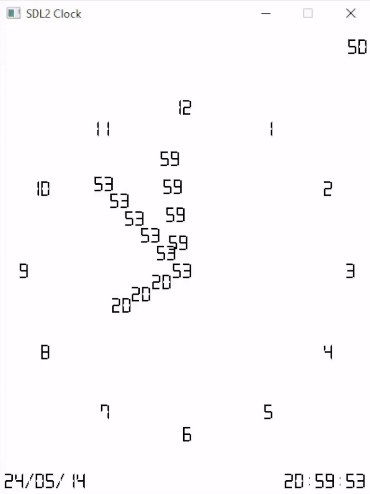

# sdl2-clock

Dumb monofile project for a **2D analog-digital clock**.

## Demo

<kbd align="center"></kbd>

## Credits

### Libraries

- [SDL2](https://www.libsdl.org/);
- [SDL_ttf](https://github.com/libsdl-org/SDL_ttf);

### Fonts

- [Digital-7](https://www.1001fonts.com/digital-7-font.html) by Sizenko Alexander of Style-7. For more info, check out the [readme.txt](./sdl2-clock/resources/fonts/readme.txt);
